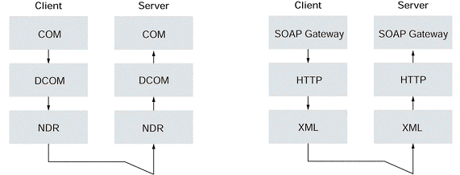

# soap
## 简介
### 基础
SOAP 是一种简单的基于 XML 的协议
通过HTTP进行连接
SOAP=RPC+HTTP+XML

### 功能
目标：简单性和可扩展性
软件应用、网站和各种设备之间的通信
穿透防火墙
### 问题
效率不高，xml需要额外的文件解析
仅能用于简单结构的数据的表示和传输
### 结构
SOAP封装(envelop)，sender,content,reciver；
SOAP编码规则（encoding rules），用于表示应用程序需要使用的数据类型的实例; 
SOAP RPC表示(RPC representation)，表示远程过程调用和应答的协定;
SOAP绑定（binding），使用底层协议交换信息。
### 过程
